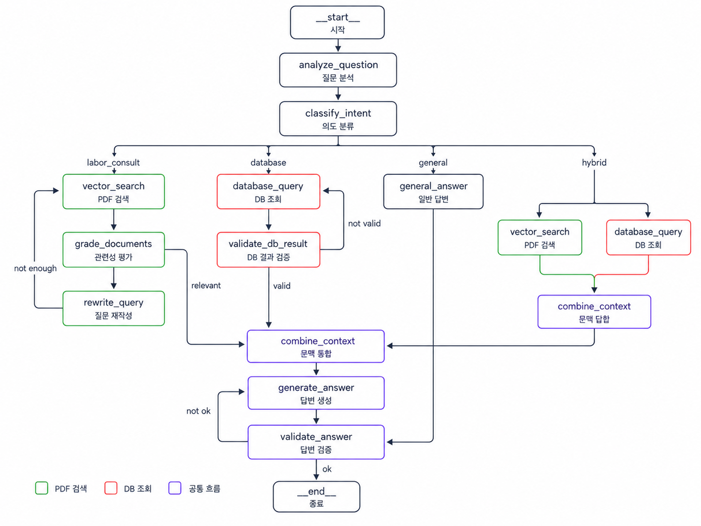

# SMU AI Training · 팀 프로젝트

> RAG · Text2SQL · LangGraph 기반 데이터 조회 에이전트

## Day2 - 문서 기반 RAG 시스템 구축 
### 주제 : 노동자 근로기준법 도우미

법을 잘 모르는 노동자가 일상적인 말로 물어보면, 고용노동부 공식 가이드북에서 근거를 찾아 쉬운 말로 답해주는 상담 도우미입니다.

### 사용 데이터

[고용노동부] 2026년 노무관리 가이드북 ([고용노동부] 2026년 노무관리 가이드북__.pdf)

### 테스트 질문

```
"알바인데 임금명세서를 안 주는데 원래 주는 건가요?"
  → 사장님은 임금명세서를 교부할 의무가 있습니다. 위반 시 500만원 이하 과태료...
     (출처: 2026년 노무관리 가이드북, 44쪽)
```
---

## Day3. 테이블 데이터 조회 시스템 Text2SQL 구축
### 주제 : 노동자 근로기준법 도우미

같은 가이드북의 목차와 서식 목록을 3개 테이블로 정규화했습니다.

| 테이블 | 내용 | 주요 컬럼 |
|---|---|---|
| `categories` | 가이드북 전체 + 16개 장의 계층 구조 | `category_id`, `category_name`, `parent_category_id`, `category_level`, `category_code` |
| `topics` | 절 단위 항목과 소관 부서 | `topic_id`, `category_id`, `topic_code`, `page_start`, `related_law`, `dept_name`, `dept_phone` |
| `forms` | 표준근로계약서 등 서식 목록 | `form_id`, `form_name`, `related_topic_code`, `page`, `form_type` |

### 테스트 질문

```python
questions = [
    "표준근로계약서 서식은 몇 쪽에 있어?",
    "장별로 항목이 몇 개씩 있는지 알려줘",
    "기간제법 관련 항목은 뭐가 있어?",
    "근로기준정책과가 담당하는 항목 전부 보여줘",
]
```
---

## Day4. RAG·Text2SQL 기반 데이터 조회 시스템
### 주제 : IOT 디바이스 하드웨어·보안 통합 점검 

4장에서 설계한 분기를 LangGraph 그래프로 구현했습니다. 질문 의도를 분류해 **PDF 경로 / DB 경로 / 두 경로 병렬** 중 하나를 자동으로 선택합니다.

### 사용 데이터 
IoT 디바이스의 하드웨어 설계와 보안 요소를 함께 조회·점검할 수 있도록 다음 4개 기술 문서와 가이드 데이터를 사용했습니다.
| 문서                       | 주요 내용                                                    |
| ------------------------ | -------------------------------------------------------- |
| `IoT_공통보안가이드.pdf`        | IoT 제품 설계·개발·운영 단계의 공통 보안 원칙                             |
| `KISA_홈가전IoT보안가이드.pdf`   | 홈·가전 IoT 제품의 물리적 보안, 인증, 암호화, 데이터 보호                     |
| `STM32_MCU_디버깅_가이드.pdf`  | STM32의 JTAG/SWD, 디버깅, 메모리 보호, 하드웨어 점검                    |
| `ESP32-H2_기술_참조_매뉴얼.pdf` | GPIO, UART, SPI, I2C, 메모리, 전원, 암호화 등 ESP32-H2 하드웨어·보안 기능 |

### 테스트 질문
```python
questions = [
    "스마트 도어락을 만들 때 하드웨어는 어떻게 구성하고, 보안은 어떻게 적용해야 하나요?",
    "ESP32-H2에서 센서나 주변장치를 연결할 때 사용할 수 있는 하드웨어 인터페이스를 알려줘",
    "IoT 제품에서 JTAG와 UART 같은 디버그 포트를 왜 보호해야 하나요?",
    "STM32에서 프로그램과 메모리를 보호할 수 있는 기능은 무엇인가요?",
]
```
### 5-2. 그래프 구조


